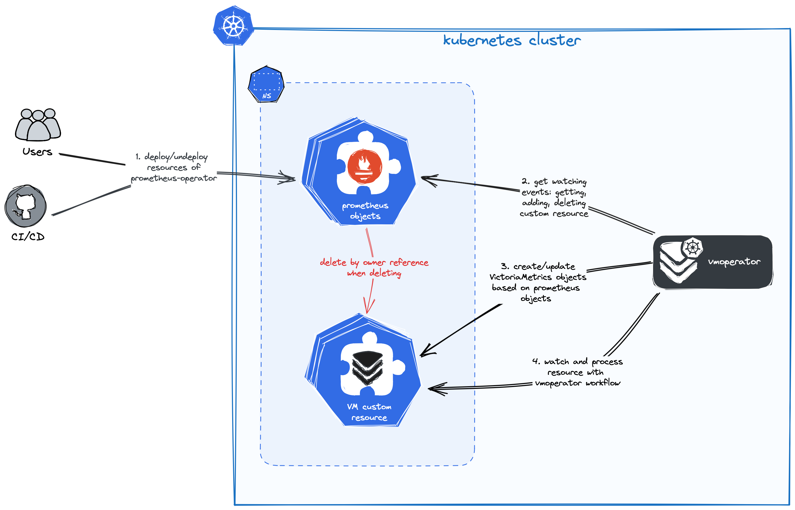

# Migration from prometheus-operator

Design and implementation inspired by [prometheus-operator](https://github.com/prometheus-operator/prometheus-operator).
It's great a tool for managing monitoring configuration of your applications. VictoriaMetrics operator has api capability with it.

So you can use familiar CRD objects: `ServiceMonitor`, `PodMonitor`, `PrometheusRule`, `Probe` and `AlertmanagerConfig`.

Or you can use VictoriaMetrics CRDs:

- `VMServiceScrape` (instead of `ServiceMonitor`) - defines scraping metrics configuration from pods backed by services. [See details](https://docs.victoriametrics.com/vmoperator/resources/vmservicescrape.html).
- `VMPodScrape` (instead of `PodMonitor`) - defines scraping metrics configuration from pods. [See details](https://docs.victoriametrics.com/vmoperator/resources/vmpodscrape.html).
- `VMRule` (instead of `PrometheusRule`) - defines alerting or recording rules. [See details](https://docs.victoriametrics.com/vmoperator/resources/vmrule.html).
- `VMProbe` (instead of `Probe`) - defines a probing configuration for targets with blackbox exporter. [See details](https://docs.victoriametrics.com/vmoperator/resources/vmprobe.html).
- `VMAlertmanagerConfig` (instead of `AlertmanagerConfig`) - defines a configuration for AlertManager. [See details](https://docs.victoriametrics.com/vmoperator/resources/vmalertmanagerconfig.html).

The default behavior of the operator is as follows:

- It **converts** all existing Prometheus `ServiceMonitor`, `PodMonitor`, `PrometheusRule` and `Probe` objects into corresponding VictoriaMetrics Operator objects.
- It **syncs** updates (including labels) from Prometheus `ServiceMonitor`, `PodMonitor`, `PrometheusRule` and `Probe` objects to corresponding VictoriaMetrics Operator objects.
- It **DOES NOT delete** converted objects after original ones are deleted.

With this configuration removing prometheus-operator API objects wouldn't delete any converted objects. So you can safely migrate or run two operators at the same time.

You can change default behavior with operator configuration - [see details below](#objects-conversion).

## Objects conversion

By default, the vmoperator converts all existing [prometheus-operator](https://github.com/prometheus-operator/prometheus-operator)
API objects into corresponding VictoriaMetrics Operator objects ([see above](#migration-from-prometheus-operator)).

You can control this behaviour by setting env variable for operator:

```console
# disable convertion for each object
VM_ENABLEDPROMETHEUSCONVERTER_PODMONITOR=false
VM_ENABLEDPROMETHEUSCONVERTER_SERVICESCRAPE=false
VM_ENABLEDPROMETHEUSCONVERTER_PROMETHEUSRULE=false
VM_ENABLEDPROMETHEUSCONVERTER_PROBE=false
```

For [victoria-metrics-operator helm-chart](https://github.com/VictoriaMetrics/helm-charts/blob/master/charts/victoria-metrics-operator/README.md) you can use following way:

```yaml
# values.yaml

# ...
operator:
  # -- By default, operator converts prometheus-operator objects.
  disable_prometheus_converter: true
# ...
```

Otherwise, VictoriaMetrics Operator would try to discover prometheus-operator API and convert it.



For more information about the operator's workflow, see [this doc](https://docs.victoriametrics.com/vmoperator/#workflow).

## Deletion synchronization

By default, the operator doesn't make converted objects disappear after original ones are deleted. To change this behaviour
configure adding `OwnerReferences` to converted objects with following [operator parameter](https://docs.victoriametrics.com/vmoperator/setup.html#settings):

```console
VM_ENABLEDPROMETHEUSCONVERTEROWNERREFERENCES=true
```

For [victoria-metrics-operator helm-chart](https://github.com/VictoriaMetrics/helm-charts/blob/master/charts/victoria-metrics-operator/README.md) you can use following way:

```yaml
# values.yaml

# ...
operator:
  # -- Enables ownership reference for converted prometheus-operator objects,
  # it will remove corresponding victoria-metrics objects in case of deletion prometheus one.
  enable_converter_ownership: true
# ...
```

Converted objects will be linked to the original ones and will be deleted by kubernetes after the original ones are deleted.

## Update synchronization

Conversion of api objects can be controlled by annotations, added to `VMObject`s.

Annotation `operator.victoriametrics.com/ignore-prometheus-updates` controls updates from Prometheus api objects.

By default, it set to `disabled`. You define it to `enabled` state and all updates from Prometheus api objects will be ignored.

Example:

```yaml
apiVersion: operator.victoriametrics.com/v1beta1
kind: VMServiceScrape
metadata:
  annotations:
    meta.helm.sh/release-name: prometheus
    operator.victoriametrics.com/ignore-prometheus-updates: enabled
  labels:
    release: prometheus
  name: prometheus-monitor
spec:
  endpoints: []
```

Annotation `operator.victoriametrics.com/ignore-prometheus-updates` can be set on one of the resources:

- [VMServiceScrape](https://docs.victoriametrics.com/vmoperator/resources/vmservicescrape.html)
- [VMPodScrape](https://docs.victoriametrics.com/vmoperator/resources/vmpodscrape.html)
- [VMRule](https://docs.victoriametrics.com/vmoperator/resources/vmrule.html)
- [VMProbe](https://docs.victoriametrics.com/vmoperator/resources/vmprobe.html)
- [VMAlertmanagerConfig](https://docs.victoriametrics.com/vmoperator/resources/vmalertmanagerconfig.html)

And annotation doesn't make sense for [VMStaticScrape](https://docs.victoriametrics.com/vmoperator/resources/vmstaticscrape.html)
and [VMNodeScrape](https://docs.victoriametrics.com/vmoperator/resources/vmnodescrape.html) because these objects are not created as a result of conversion.

## Labels synchronization

Conversion of api objects can be controlled by annotations, added to `VMObject`s.

Annotation `operator.victoriametrics.com/merge-meta-strategy` controls syncing of metadata labels and annotations
between `VMObject`s and `Prometheus` api objects during updates to `Prometheus` objects.

By default, it has `prefer-prometheus`. And annotations and labels will be used from `Prometheus` objects, manually set values will be dropped.

You can set it to `prefer-victoriametrics`. In this case all labels and annotations applied to `Prometheus` object will be ignored and `VMObject` will use own values.

Two additional strategies annotations -`merge-victoriametrics-priority` and `merge-prometheus-priority` merges labelSets into one combined labelSet, with priority.

Example:

```yaml
apiVersion: operator.victoriametrics.com/v1beta1
kind: VMServiceScrape
metadata:
  annotations:
    meta.helm.sh/release-name: prometheus
    operator.victoriametrics.com/merge-meta-strategy: prefer-victoriametrics
  labels:
    release: prometheus
  name: prometheus-monitor
spec:
  endpoints: []
```

Annotation `operator.victoriametrics.com/merge-meta-strategy` can be set on one of the resources:

- [VMServiceScrape](https://docs.victoriametrics.com/vmoperator/resources/vmservicescrape.html)
- [VMPodScrape](https://docs.victoriametrics.com/vmoperator/resources/vmpodscrape.html)
- [VMRule](https://docs.victoriametrics.com/vmoperator/resources/vmrule.html)
- [VMProbe](https://docs.victoriametrics.com/vmoperator/resources/vmprobe.html)
- [VMAlertmanagerConfig](https://docs.victoriametrics.com/vmoperator/resources/vmalertmanagerconfig.html)

And annotation doesn't make sense for [VMStaticScrape](https://docs.victoriametrics.com/vmoperator/resources/vmstaticscrape.html)
and [VMNodeScrape](https://docs.victoriametrics.com/vmoperator/resources/vmnodescrape.html) because these objects are not created as a result of conversion.

## Data migration

You can use [vmctl](https://docs.victoriametrics.com/vmctl.html) for migrating your data from Prometheus to VictoriaMetrics.

See [this doc](https://docs.victoriametrics.com/vmctl.html#migrating-data-from-prometheus) for more details.
