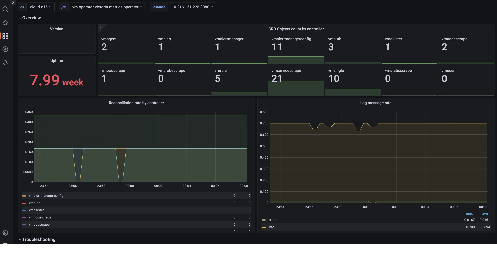

VictoriaMetrics operator exports internal metrics in Prometheus exposition format at `/metrics` page.

These metrics can be scraped via [vmagent](https://docs.victoriametrics.com/operator/resources/vmagent/) or Prometheus.

## Metrics reference

In addition to the standard [controller-runtime](https://pkg.go.dev/sigs.k8s.io/controller-runtime/pkg/metrics) metrics
(`controller_runtime_reconcile_total`, `workqueue_*`, `rest_client_requests_total`, etc.), the operator exposes:

### Build info and runtime

- `vm_app_version{k8s_version}` - always `1`; `version` and `short_version` are exposed as const labels, `k8s_version` as the version of the connected Kubernetes API server.
- `vm_app_uptime_seconds` - seconds since the operator process started.
- `vm_app_start_timestamp` - unix timestamp of process start.
- `operator_rest_client_qps_limit` - configured max queries-per-second for the Kubernetes API client.
- `rest_client_request_duration_seconds{method, api}` - latency of Kubernetes API requests, for a curated list of API groups (to avoid high cardinality).
- `flag{name, value, is_set}` - operator CLI flags and whether each was explicitly set.

### Reconciliation and errors

- `operator_controller_errors_total{controller, namespace, name, reason}` - reconcile failures by controller and `reason` (`get_object`, `parse_object`, `cancel_context`, `conflict`, `other`).
- `operator_reconcile_throttled_events_total{controller}` - number of reconcile events dropped by the per-controller rate limiter.
- `operator_log_messages_total{level}` - count of log messages emitted by the operator, by level.
- `operator_fetch_errors_total{object, key}` - user-defined objects (e.g. `VMAgent`, `VMAlert`) referencing a missing `Secret`/`ConfigMap` key.
- `operator_bad_objects_total{crd, object_namespace}` - number of incorrect/incomplete child CRDs (e.g. `VMRule`, `VMAlertmanagerConfig`) by type and namespace.
- `operator_prometheus_converter_active_watchers{object_type_name}` - active watchers converting `prometheus-operator` CRDs (`ServiceMonitor`, `PodMonitor`, `PrometheusRule`) into their VictoriaMetrics equivalents.

> The following are deprecated and will be removed after v0.80.0, superseded by `operator_controller_errors_total`:
> `operator_controller_object_parsing_errors_total`, `operator_controller_object_get_errors_total`,
> `operator_controller_reconcile_conflict_errors_total`, `operator_controller_reconcile_errors_total`,
> `operator_alertmanager_bad_objects_count`, `operator_vmalert_bad_objects_count`.

## Dashboard

Official Grafana dashboard available for [vmoperator](https://grafana.com/grafana/dashboards/17869-victoriametrics-operator/).



Graphs on the dashboards contain useful hints - hover the `i` icon in the top left corner of each graph to read it.

## Alerting rules

Alerting rules for VictoriaMetrics operator are available [here](https://github.com/VictoriaMetrics/operator/blob/master/config/alerting/vmoperator-rules.yaml).

## Configuration

### Helm-chart victoria-metrics-k8s-stack

In [victoria-metrics-k8s-stack](https://docs.victoriametrics.com/helm/victoria-metrics-k8s-stack/) helm-chart operator self-scrapes metrics by default.

This helm-chart also includes [official grafana dashboard for operator](https://docs.victoriametrics.com/operator/monitoring/#dashboard) and [official alerting rules for operator](https://docs.victoriametrics.com/operator/monitoring/#alerting-rules).

### Helm-chart victoria-metrics-operator

With [victoria-metrics-operator](https://docs.victoriametrics.com/helm/victoria-metrics-operator/) you can use following parameter in `values.yaml`:

```yaml
# values.yaml
#...
# -- configures monitoring with serviceScrape. VMServiceScrape must be pre-installed
serviceMonitor:
  enabled: true
```

This parameter makes helm-chart to create a scrape-object for installed operator instance.

You will also need to deploy a (vmsingle)[https://docs.victoriametrics.com/operator/resources/vmsingle] where the metrics will be collected.

### Pure operator installation

With pure operator installation you can use config with separate vmsingle and scrape object for operator like that:

```yaml
apiVersion: operator.victoriametrics.com/v1beta1
kind: VMServiceScrape
metadata:
  name: vmoperator
  namespace: monitoring
spec:
  selector:
    matchLabels:
      app.kubernetes.io/instance: vm-operator
      app.kubernetes.io/name: victoria-metrics-operator
  endpoints:
    - port: http
  namespaceSelector:
    matchNames:
      - monitoring
```

See more info about object [VMServiceScrape](https://docs.victoriametrics.com/operator/resources/vmservicescrape/).

You will also need a [vmsingle](https://docs.victoriametrics.com/operator/resources/vmsingle/) where the metrics will be collected.
