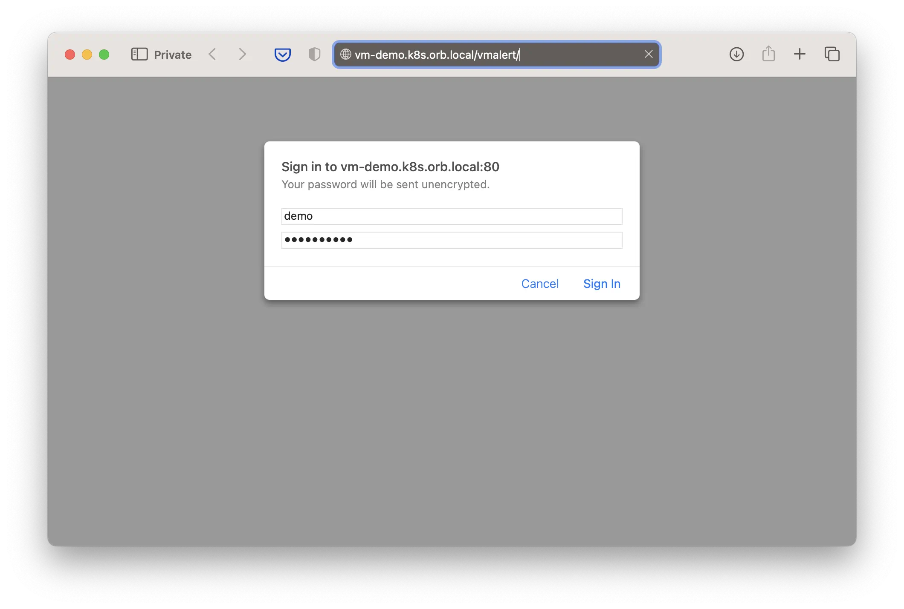
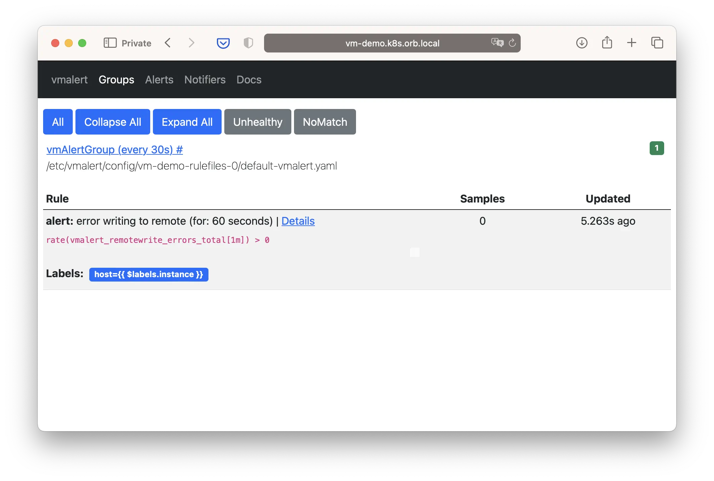

This guide walks you through the easiest way to install VictoriaMetrics in a [Kubernetes](https://kubernetes.io/) cluster using the VictoriaMetrics [operator](https://github.com/VictoriaMetrics/operator/).
While other [installation methods](https://docs.victoriametrics.com/operator/setup) offer more flexibility, 
this approach keeps things simple and helps you get up and running with minimal effort.

By the end of this guide, you’ll have a fully functional setup that includes:
- `VMSingle` – for storing and querying metrics
- `VMAgent` and `VMServiceScrape` – for scraping targets
- `VMAlert` and `VMRule` – for managing alerts

You’ll also learn how to interact with the system using basic tools like `kubectl` and `curl`.

Read more about the operator pattern in the [Kubernetes documentation](https://kubernetes.io/docs/concepts/extend-kubernetes/operator/).

Before we proceed, let’s verify that you have access to your Kubernetes cluster. 
Run the following command and ensure the output includes a server version:
```bash
kubectl version

# Client Version: v1.32.3
# Kustomize Version: v5.5.0
# Server Version: v1.32.2
```
If you don't have a Kubernetes cluster, you can quickly spin up a local one using [Kind](https://kind.sigs.k8s.io/).

Please note that [certain permissions](https://docs.victoriametrics.com/operator/security#roles) may be required for the operator to function properly.

## Setup operator

Download the latest [operator release](https://github.com/VictoriaMetrics/operator/latest) from GitHub:
```bash
export VM_OPERATOR_VERSION=$(basename $(curl -fs -o /dev/null -w %{redirect_url} \
  https://github.com/VictoriaMetrics/operator/releases/latest))
echo "VM_OPERATOR_VERSION=$VM_OPERATOR_VERSION"

wget -O operator-and-crds.yaml \
  "https://github.com/VictoriaMetrics/operator/releases/download/$VM_OPERATOR_VERSION/install-no-webhook.yaml"

# VM_OPERATOR_VERSION=v0.56.0
# ...
```

The commands above will download the operator manifest and save it as `operator-and-crds.yaml` in your current directory.
Let’s take a quick look at the file’s contents. The beginning of the file should contain a standard Kubernetes YAML resource definition.
```bash
head -n 10 operator-and-crds.yaml

# apiVersion: v1
# kind: Namespace
# metadata:
# labels:
# app.kubernetes.io/managed-by: kustomize
# app.kubernetes.io/name: vm-operator
# control-plane: vm-operator
# name: vm
# ---
```

Apply the manifest to your cluster:
```bash
kubectl apply -f operator-and-crds.yaml

# namespace/vm configured
# customresourcedefinition.apiextensions.k8s.io/vlogs.operator.victoriametrics.com configured
# customresourcedefinition.apiextensions.k8s.io/vmagents.operator.victoriametrics.com configured
# ...
```
The apply command installs the operator and CRDs in the `vm` namespace.
Once it's running, it will start watching for VictoriaMetrics custom resources and manage them automatically.

You can confirm the operator is running by checking the pod status:
```bash
kubectl get pods -n vm -l "control-plane=vm-operator"

# NAME                           READY   STATUS    RESTARTS   AGE
# vm-operator-5db95b48bd-j6m9v   1/1     Running   0          2m27s
```

The operator introduces [custom resources](https://docs.victoriametrics.com/operator/resources/) to the cluster, 
which you can list using the following command:
```bash
kubectl api-resources --api-group=operator.victoriametrics.com

# NAME                    SHORTNAMES   APIVERSION                             NAMESPACED   KIND
# vlogs                                operator.victoriametrics.com/v1beta1   true         VLogs
# vmagents                             operator.victoriametrics.com/v1beta1   true         VMAgent
# vmsingles                            operator.victoriametrics.com/v1beta1   true         VMSingle
# ...
```
You can interact with VictoriaMetrics resources in the same way as you would with built-in Kubernetes resources. 
For example, to get a list of `VMSingle` resources, you can run `kubectl get vmsingle -n vm`. 
This knowledge will help you manage and inspect the custom resources within the cluster efficiently in later sections.

The operator is configured using [environment variables](https://docs.victoriametrics.com/operator/vars/). 
You can consult the documentation or explore the variables directly in your cluster (note that `kubectl exec` may require [additional permissions](https://discuss.kubernetes.io/t/adding-permission-to-exec-commands-in-containers-inside-pods-in-a-certain-namespace/22821/2)).
Here’s an example showing how to get the default CPU and memory limits applied to the VMSingle resource:
```bash 
OPERATOR_POD_NAME=$(kubectl get pod -l "control-plane=vm-operator"  -n vm -o jsonpath="{.items[0].metadata.name}")
kubectl exec -n vm "$OPERATOR_POD_NAME" -- /app --printDefaults 2>&1 | grep VMSINGLEDEFAULT_RESOURCE

# VM_VMSINGLEDEFAULT_RESOURCE_LIMIT_MEM     1500Mi   false       
# VM_VMSINGLEDEFAULT_RESOURCE_LIMIT_CPU     1200m    false       
# VM_VMSINGLEDEFAULT_RESOURCE_REQUEST_MEM   500Mi    false       
# VM_VMSINGLEDEFAULT_RESOURCE_REQUEST_CPU   150m     false 
```

At this point, you should have a functional operator and [custom resources](https://docs.victoriametrics.com/operator/resources/) set up in your cluster. 
You can now proceed with installing the metrics storage `VMSingle`.

## Setup storage

The easiest and production-ready way to run VictoriaMetrics storage in Kubernetes is by using the [VMSingle](https://docs.victoriametrics.com/operator/resources/vmsingle) resource.
It deploys a [VictoriaMetrics single-node](https://docs.victoriametrics.com/victoriametrics/single-server-victoriametrics/) instance.
Although it runs as a single pod, the setup is recommended for production use.
`VMSingle` can scale vertically and efficiently handle high volumes of metric ingestion and querying.

First, create a `VMSingle` manifest file:
```bash
cat > vmsingle-demo.yaml <<'EOF'
apiVersion: operator.victoriametrics.com/v1beta1
kind: VMSingle
metadata:
  name: demo
  namespace: vm
EOF
```

Next, apply the manifest to your Kubernetes cluster:
```bash
kubectl apply -f vmsingle-demo.yaml
```
That's it! You now have a fully operational VictoriaMetrics storage instance running in the `vm` namespace.

To confirm that `VMSingle` is running, run the following commands. You should see output similar to this:
```bash
kubectl get vmsingle -n vm

#NAME   STATUS        AGE
#demo   operational   5h48m

kubectl get pods -n vm -l "app.kubernetes.io/name=vmsingle"

# NAME                             READY   STATUS    RESTARTS   AGE
# vmsingle-demo-54f8fc5777-sw6xp   1/1     Running   0          5h28m
```

Let’s explore how to interact with the storage. First, you need to make the storage port accessible from your machine.
To do this, open a separate terminal and run the port-forward command below:
```bash
VMSINGLE_POD_NAME=$(kubectl get pod -n vm -l "app.kubernetes.io/name=vmsingle" -o jsonpath="{.items[0].metadata.name}")
kubectl port-forward -n vm $VMSINGLE_POD_NAME 8429:8429

# Forwarding from 127.0.0.1:8429 -> 8429
# Forwarding from [::1]:8429 -> 8429
```
Make sure it stays up and running throughout the rest of this documentation.

You can use the `/api/v1/import/prometheus` endpoint to store metrics using the [Prometheus exposition format](https://prometheus.io/docs/concepts/data_model/).
The following example demonstrates how to post a simple `a_metric` with a label and value:
```bash
curl -i -X POST \
  --url http://127.0.0.1:8429/api/v1/import/prometheus \
  --header 'Content-Type: text/plain' \
  --data 'a_metric{foo="fooVal"} 123'

# HTTP/1.1 204 No Content
# ...
```

To retrieve metrics from VictoriaMetrics, you can use either of the following HTTP endpoints:
- `/api/v1/query` — for instant (point-in-time) queries
- `/api/v1/query_range` — for range queries over a specified time window

Keep in mind that metrics become available for querying 30 seconds after they're collected.
Here’s an example using query endpoint to fetch `a_metric` data:
```bash
curl -i --url http://127.0.0.1:8429/api/v1/query --url-query query=a_metric

# HTTP/1.1 200 OK
# ...
# {"status":"success","data":{"resultType":"vector","result":[{"metric":{"__name__":"a_metric","foo":"fooVal"},"value":[1746099757,"123"]}]},"stats":{"seriesFetched": "1","executionTimeMsec":0}}
```

For an interactive way to explore and query metrics, visit the built-in VMUI at: http://127.0.0.1:8429/vmui

VictoriaMetrics stores all ingested metrics on the filesystem.
You can verify that data is being persisted by inspecting the storage directory inside the `VMSingle` pod:
```bash
VMSINGLE_POD_NAME=$(kubectl get pod -l "app.kubernetes.io/name=vmsingle"  -n vm -o jsonpath="{.items[0].metadata.name}")

kubectl exec -n vm "$VMSINGLE_POD_NAME" -- ls -l  /victoria-metrics-data

# total 20
# drwxr-xr-x    4 root     root          4096 Apr 30 12:20 data
# -rw-r--r--    1 root     root             0 Apr 30 12:20 flock.lock
# drwxr-xr-x    6 root     root          4096 Apr 30 12:20 indexdb
# drwxr-xr-x    2 root     root          4096 Apr 30 12:20 metadata
# drwxr-xr-x    2 root     root          4096 Apr 30 12:20 snapshots
# drwxr-xr-x    3 root     root          4096 Apr 30 12:20 tmp
```

### Scraping

#### VMAgent

Now let's deploy [`vmagent`](https://docs.victoriametrics.com/operator/resources/vmagent) resource.

Create file `vmagent.yaml` 

```shell
code vmagent.yaml
```

with the following content:

```yaml
apiVersion: operator.victoriametrics.com/v1beta1
kind: VMAgent
metadata:
  name: demo
spec:
  selectAllByDefault: true
  remoteWrite:
    - url: "http://vminsert-demo.vm.svc:8480/insert/0/prometheus/api/v1/write"
```

After that you can deploy `vmagent` resource to the kubernetes cluster:

```shell
kubectl apply -f vmagent.yaml -n vm

# vmagent.operator.victoriametrics.com/demo created
```

Check that `vmagent` is running:

```shell
kubectl get pods -n vm -l "app.kubernetes.io/instance=demo" -l "app.kubernetes.io/name=vmagent"

# NAME                            READY   STATUS    RESTARTS   AGE
# vmagent-demo-6785f7d7b9-zpbv6   2/2     Running   0          72s
```

More information about `vmagent` resource you can find on 
the [vmagent page](https://docs.victoriametrics.com/operator/resources/vmagent).

#### VMServiceScrape

Now we have the timeseries database (vmcluster) and the tool to collect metrics (vmagent) and send it to the database.

But we need to tell vmagent what metrics to collect. For this we will use [`vmservicescrape`](https://docs.victoriametrics.com/operator/resources/vmservicescrape) resource
or [other `*scrape` resources](https://docs.victoriametrics.com/operator/resources/).

By default, operator creates `vmservicescrape` resource for each component that it manages. More details about this you can find on
the [monitoring page](https://docs.victoriametrics.com/operator/configuration#monitoring-of-cluster-components).

For instance, we can create `vmservicescrape` for VictoriaMetrics operator manually. Let's create file `vmservicescrape.yaml`:

```shell
code vmservicescrape.yaml
```

with the following content:

```yaml
apiVersion: operator.victoriametrics.com/v1beta1
kind: VMServiceScrape
metadata:
  name: vmoperator-demo
spec:
  selector:
    matchLabels:
      app.kubernetes.io/instance: vmoperator
      app.kubernetes.io/name: victoria-metrics-operator
  namespaceSelector: 
    matchNames:
      - vm
  endpoints:
  - port: http
```

After that you can deploy `vmservicescrape` resource to the kubernetes cluster:

```shell
kubectl apply -f vmservicescrape.yaml -n vm

# vmservicescrape.operator.victoriametrics.com/vmoperator-demo created
```

### Access

We need to look at the results of what we got. Up until now, we've just been looking only at the status of the pods. 

#### VMAuth

Let's expose our components with [`vmauth`](https://docs.victoriametrics.com/operator/resources/vmauth).

Create file `vmauth.yaml` 

```shell
code vmauth.yaml
```

with the following content:

```yaml
apiVersion: operator.victoriametrics.com/v1beta1
kind: VMAuth
metadata:
  name: demo
spec:
  selectAllByDefault: true
  userNamespaceSelector: {}
  userSelector: {}
  ingress:
    class_name: nginx # <-- change this to your ingress-controller
    host: vm-demo.k8s.orb.local # <-- change this to your domain
```

**Note** that content of `ingress` field depends on your ingress-controller and domain.
Your cluster will have them differently. 
Also, for simplicity, we don't use tls, but in real environments not having tls is unsafe.

#### VMUser

To get authorized access to our data it is necessary to create a user using 
the [vmuser](https://docs.victoriametrics.com/operator/resources/vmuser) resource.

Create file `vmuser.yaml` 

```shell
code vmuser.yaml
```

with the following content:

```yaml
apiVersion: operator.victoriametrics.com/v1beta1
kind: VMUser
metadata:
  name: demo
spec:
    name: demo
    username: demo
    generatePassword: true
    targetRefs:
      # vmui + vmselect
      - crd:
          kind: VMCluster/vmselect
          name: demo
          namespace: vm
        target_path_suffix: "/select/0"
        paths:
          - "/vmui"
          - "/vmui/.*"
          - "/prometheus/api/v1/query"
          - "/prometheus/api/v1/query_range"
          - "/prometheus/api/v1/series"
          - "/prometheus/api/v1/status/.*"
          - "/prometheus/api/v1/label/"
          - "/prometheus/api/v1/label/[^/]+/values"
```

After that you can deploy `vmauth` and `vmuser` resources to the kubernetes cluster:

```shell
kubectl apply -f vmauth.yaml -n vm
kubectl apply -f vmuser.yaml -n vm

# vmauth.operator.victoriametrics.com/demo created
# vmuser.operator.victoriametrics.com/demo created
```

Operator automatically creates a secret with username/password token for `VMUser` resource with `generatePassword=true`:

```shell
kubectl get secret -n vm -l "app.kubernetes.io/instance=demo" -l "app.kubernetes.io/name=vmuser"

# NAME          TYPE     DATA   AGE
# vmuser-demo   Opaque   3      29m
```

You can get password for your user with command:

```shell
kubectl get secret -n vm vmuser-demo -o jsonpath="{.data.password}" | base64 --decode

# Yt3N2r3cPl
```

Now you can get access to your data with url `http://vm-demo.k8s.orb.local/vmui`, username `demo` 
and your given password (`Yt3N2r3cPl` in our case):


### Alerting

The remaining components will be needed for alerting. 

#### VMAlertmanager

Let's start with [`vmalertmanager`](https://docs.victoriametrics.com/operator/resources/vmalertmanager).

Create file `vmalertmanager.yaml`

```shell
code vmalertmanager.yaml
```

with the following content:

```yaml
apiVersion: operator.victoriametrics.com/v1beta1
kind: VMAlertmanager
metadata:
  name: demo
spec:
  configRawYaml: |
    global:
      resolve_timeout: 5m
    route:
      group_wait: 30s
      group_interval: 5m
      repeat_interval: 12h
      receiver: 'webhook'
    receivers:
    - name: 'webhook'
      webhook_configs:
      - url: 'http://your-webhook-url'
```

where webhook-url is the address of the webhook to receive notifications 
(configuration of AlertManager notifications will remain out of scope).
You can find more details about `alertmanager` configuration in 
the [Alertmanager documentation](https://prometheus.io/docs/alerting/latest/configuration/).

After that you can deploy `vmalertmanager` resource to the kubernetes cluster:

```shell
kubectl apply -f vmalertmanager.yaml -n vm

# vmalertmanager.operator.victoriametrics.com/demo created
```

Check that `vmalertmanager` is running:

```shell
kubectl get pods -n vm -l "app.kubernetes.io/instance=demo" -l "app.kubernetes.io/name=vmalertmanager"

# NAME                    READY   STATUS    RESTARTS   AGE
# vmalertmanager-demo-0   2/2     Running   0          107s
```

#### VMAlert

And now you can create [`vmalert`](https://docs.victoriametrics.com/operator/resources/vmalert) resource.

Create file `vmalert.yaml`

```shell
code vmalert.yaml
```

with the following content:

```yaml
apiVersion: operator.victoriametrics.com/v1beta1
kind: VMAlert
metadata:
  name: demo
spec:
  datasource:
    url: "http://vmselect-demo.vm.svc:8481/select/0/prometheus"
  remoteWrite:
    url: "http://vminsert-demo.vm.svc:8480/insert/0/prometheus"
  remoteRead:
    url: "http://vmselect-demo.vm.svc:8481/select/0/prometheus"
  notifier:
    url: "http://vmalertmanager-demo.vm.svc:9093"
  evaluationInterval: "30s"
  selectAllByDefault: true
  # for accessing to vmalert via vmauth with path prefix
  extraArgs:
    http.pathPrefix: /vmalert
```

After that you can deploy `vmalert` resource to the kubernetes cluster:

```shell
kubectl apply -f vmalert.yaml -n vm

# vmalert.operator.victoriametrics.com/demo created
```

Check that `vmalert` is running:

```shell
kubectl get pods -n vm -l "app.kubernetes.io/instance=demo" -l "app.kubernetes.io/name=vmalert"

# NAME                           READY   STATUS    RESTARTS   AGE
# vmalert-demo-bf75c67cb-hh4qd   2/2     Running   0          5s
```

#### VMRule

Now you can create [vmrule](https://docs.victoriametrics.com/operator/resources/vmrule) resource 
for [vmalert](https://docs.victoriametrics.com/operator/resources/vmalert).

Create file `vmrule.yaml`

```shell
code vmrule.yaml
```

with the following content:

```yaml
apiVersion: operator.victoriametrics.com/v1beta1
kind: VMRule
metadata:
  name: demo
spec:
  groups:
    - name: vmalert
      rules:
        - alert: vmalert config reload error
          expr: delta(vmalert_config_last_reload_errors_total[5m]) > 0
          for: 10s
          labels:
            severity: major
            job:  "{{ $labels.job }}"
          annotations:
            value: "{{ $value }}"
            description: 'error reloading vmalert config, reload count for 5 min {{ $value }}'
```

After that you can deploy `vmrule` resource to the kubernetes cluster:

```shell
kubectl apply -f vmrule.yaml -n vm

# vmrule.operator.victoriametrics.com/demo created
```

#### VMUser update

Let's update our user with access to `vmalert` and `vmalertmanager`:

```shell
code vmuser.yaml
```

```yaml
apiVersion: operator.victoriametrics.com/v1beta1
kind: VMUser
metadata:
  name: demo
spec:
  name: demo
  username: demo
  generatePassword: true
  targetRefs:
    # vmui + vmselect
    - crd:
        kind: VMCluster/vmselect
        name: demo
        namespace: vm
      target_path_suffix: "/select/0"
      paths:
        - "/vmui"
        - "/vmui/.*"
        - "/prometheus/api/v1/query"
        - "/prometheus/api/v1/query_range"
        - "/prometheus/api/v1/series"
        - "/prometheus/api/v1/status/.*"
        - "/prometheus/api/v1/label/"
        - "/prometheus/api/v1/label/[^/]+/values"
    # vmalert
    - crd:
        kind: VMAlert
        name: demo
        namespace: vm
      paths:
        - "/vmalert"
        - "/vmalert/.*"
        - "/api/v1/groups"
        - "/api/v1/alert"
        - "/api/v1/alerts"
```

After that you can deploy `vmuser` resource to the kubernetes cluster:

```shell
kubectl apply -f vmuser.yaml -n vm

# vmuser.operator.victoriametrics.com/demo created
```

And now you can get access to your data with url `http://vm-demo.k8s.orb.local/vmalert` 
(for your environment it most likely will be different) with username `demo`:





## Anything else

That's it. We obtained a monitoring cluster corresponding to the target topology:


You have a full-stack monitoring cluster with VictoriaMetrics Operator.

You can find information about these and other resources of operator on the [Custom resources page](https://docs.victoriametrics.com/operator/resources/).

In addition, check out other sections of the documentation for VictoriaMetrics Operator:

- [Setup](https://docs.victoriametrics.com/operator/setup)
- [Security](https://docs.victoriametrics.com/operator/security)
- [Configuration](https://docs.victoriametrics.com/operator/configuration)
- [Migration from Prometheus](https://docs.victoriametrics.com/operator/migration)
- [Monitoring](https://docs.victoriametrics.com/operator/monitoring)
- [Authorization and exposing components](https://docs.victoriametrics.com/operator/auth)
- [High Availability](https://docs.victoriametrics.com/operator/high-availability)
- [Enterprise](https://docs.victoriametrics.com/operator/enterprise)

If you have any questions, check out our [FAQ](https://docs.victoriametrics.com/operator/faq)
and feel free to can ask them:
- [VictoriaMetrics Slack](https://victoriametrics.slack.com/)
- [VictoriaMetrics Telegram](https://t.me/VictoriaMetrics_en)

If you have any suggestions or find a bug, please create an issue
on [GitHub](https://github.com/VictoriaMetrics/operator/issues/new).
