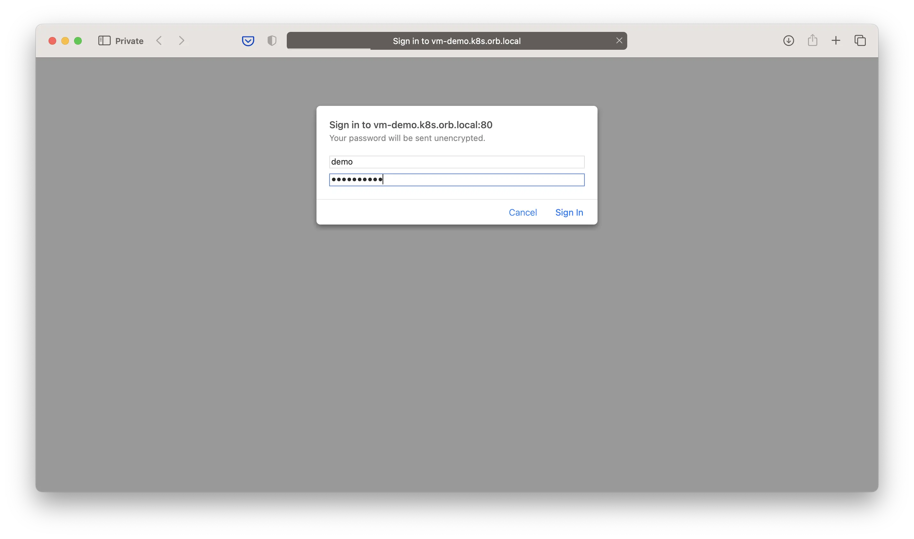
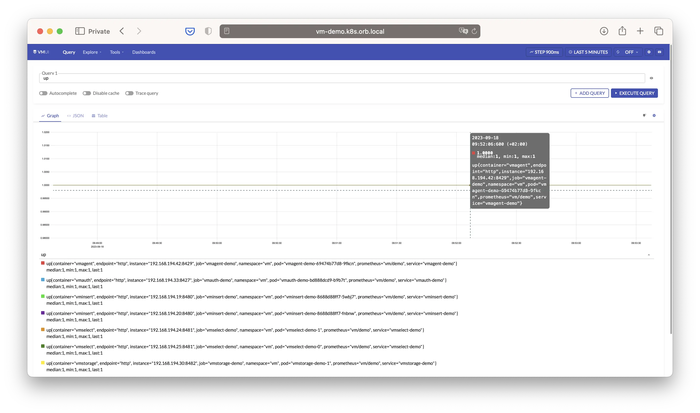
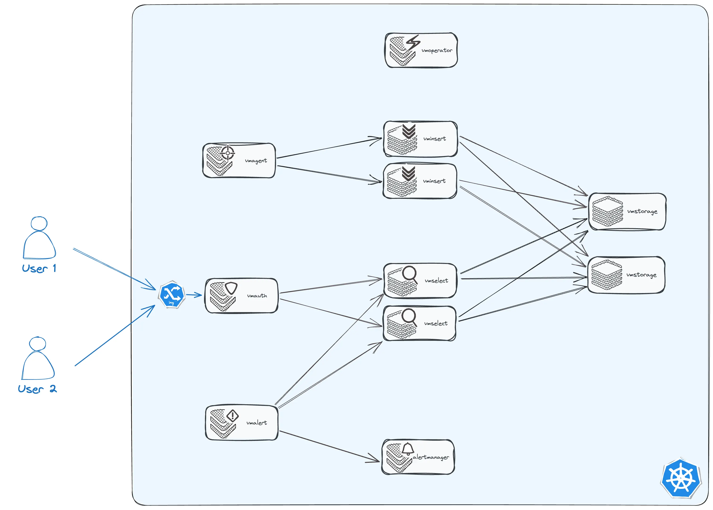

This guide walks you through the easiest way to install VictoriaMetrics in a [Kubernetes](https://kubernetes.io/) cluster using the VictoriaMetrics [operator](https://github.com/VictoriaMetrics/operator/).
While other [installation methods](https://docs.victoriametrics.com/operator/setup) offer more flexibility, 
this approach keeps things simple and helps you get up and running with minimal effort.

By the end of this guide, you’ll have a fully functional setup that includes:
- `VMSingle` – for storing and querying metrics
- `VMAgent` and `VMServiceScrape` – for scraping targets
- `VMAlertmanager`, `VMAlert` and `VMRule` – for managing alerts

You’ll also learn how to interact with the system using basic tools like `kubectl` and `curl`.

Read more about the operator pattern in the [Kubernetes documentation](https://kubernetes.io/docs/concepts/extend-kubernetes/operator/).

Before we proceed, let’s verify that you have access to your Kubernetes cluster. 
Run the following command and ensure the output includes a server version:
```sh
kubectl version

# Client Version: v1.32.3
# Kustomize Version: v5.5.0
# Server Version: v1.32.2
```
If you don't have a Kubernetes cluster, you can quickly spin up a local one using [Kind](https://kind.sigs.k8s.io/).

Please note that [certain permissions](https://docs.victoriametrics.com/operator/security#roles) may be required for the operator to function properly.

## Operator

Download the latest [operator release](https://github.com/VictoriaMetrics/operator/latest) from GitHub:
```sh
export VM_OPERATOR_VERSION=$(basename $(curl -fs -o /dev/null -w %{redirect_url} https://github.com/VictoriaMetrics/operator/releases/latest));
echo "VM_OPERATOR_VERSION=$VM_OPERATOR_VERSION";

wget -O operator-and-crds.yaml \
  "https://github.com/VictoriaMetrics/operator/releases/download/$VM_OPERATOR_VERSION/install-no-webhook.yaml";

# VM_OPERATOR_VERSION=v0.56.0
# ...
```

The commands above will download the operator manifest and save it as `operator-and-crds.yaml` in your current directory.
Let’s take a quick look at the file’s contents. The beginning of the file should contain a standard Kubernetes YAML resource definition.
```sh
head -n 10 operator-and-crds.yaml

# apiVersion: v1
# kind: Namespace
# metadata:
# labels:
# app.kubernetes.io/managed-by: kustomize
# app.kubernetes.io/name: vm-operator
# control-plane: vm-operator
# name: vm
# ---
```

Apply the manifest to your cluster:
```sh
kubectl apply -f operator-and-crds.yaml

# namespace/vm created
# customresourcedefinition.apiextensions.k8s.io/vlogs.operator.victoriametrics.com created
# customresourcedefinition.apiextensions.k8s.io/vmagents.operator.victoriametrics.com created
# ...
```
The apply command installs the operator and CRDs in the `vm` namespace.
Once it's running, it will start watching for VictoriaMetrics custom resources and manage them automatically.

You can confirm the operator is running by checking the pod status:
```sh
kubectl get pods -n vm -l "control-plane=vm-operator"

# NAME                           READY   STATUS    RESTARTS   AGE
# vm-operator-5db95b48bd-j6m9v   1/1     Running   0          2m27s
```

The operator introduces [custom resources](https://docs.victoriametrics.com/operator/resources/) to the cluster, 
which you can list using the following command:
```sh
kubectl api-resources --api-group=operator.victoriametrics.com

# NAME                    SHORTNAMES   APIVERSION                             NAMESPACED   KIND
# vlogs                                operator.victoriametrics.com/v1beta1   true         VLogs
# vmagents                             operator.victoriametrics.com/v1beta1   true         VMAgent
# vmsingles                            operator.victoriametrics.com/v1beta1   true         VMSingle
# ...
```
You can interact with VictoriaMetrics resources in the same way as you would with built-in Kubernetes resources. 
For example, to get a list of `VMSingle` resources, you can run `kubectl get vmsingle -n vm`. 
This knowledge will help you manage and inspect the custom resources within the cluster efficiently in later sections.

The operator is configured using [environment variables](https://docs.victoriametrics.com/operator/vars/). 
You can consult the documentation or explore the variables directly in your cluster (note that `kubectl exec` may require [additional permissions](https://discuss.kubernetes.io/t/adding-permission-to-exec-commands-in-containers-inside-pods-in-a-certain-namespace/22821/2)).
Here’s an example showing how to get the default CPU and memory limits applied to the VMSingle resource:
```sh 
OPERATOR_POD_NAME=$(kubectl get pod -l "control-plane=vm-operator"  -n vm -o jsonpath="{.items[0].metadata.name}");
kubectl exec -n vm "$OPERATOR_POD_NAME" -- /app --printDefaults 2>&1 | grep VMSINGLEDEFAULT_RESOURCE;

# VM_VMSINGLEDEFAULT_RESOURCE_LIMIT_MEM     1500Mi   false       
# VM_VMSINGLEDEFAULT_RESOURCE_LIMIT_CPU     1200m    false       
# VM_VMSINGLEDEFAULT_RESOURCE_REQUEST_MEM   500Mi    false       
# VM_VMSINGLEDEFAULT_RESOURCE_REQUEST_CPU   150m     false 
```

At this point, you should have a functional operator and [custom resources](https://docs.victoriametrics.com/operator/resources/) up in your cluster. 
You can now proceed with installing the metrics storage `VMSingle`.

## Storage

The easiest and production-ready way to run VictoriaMetrics storage in Kubernetes is by using the [VMSingle](https://docs.victoriametrics.com/operator/resources/vmsingle) resource.
It deploys a [VictoriaMetrics single-node](https://docs.victoriametrics.com/victoriametrics/single-server-victoriametrics/) instance.
Although it runs as a single pod, the setup is recommended for production use.
`VMSingle` can scale vertically and efficiently handle high volumes of metric ingestion and querying.

First, create a `VMSingle` manifest file:
```sh
cat <<'EOF' > vmsingle-demo.yaml
apiVersion: operator.victoriametrics.com/v1beta1
kind: VMSingle
metadata:
  name: demo
  namespace: vm
EOF
```

Next, apply the manifest to your Kubernetes cluster:
```sh
kubectl apply -f vmsingle-demo.yaml
```
That's it! You now have a fully operational VictoriaMetrics storage instance running in the `vm` namespace.

To confirm that `VMSingle` is running, run the following commands. You should see output similar to this:
```sh
kubectl get vmsingle -n vm;

#NAME   STATUS        AGE
#demo   operational   5h48m

kubectl get pods -n vm -l "app.kubernetes.io/name=vmsingle";

# NAME                             READY   STATUS    RESTARTS   AGE
# vmsingle-demo-54f8fc5777-sw6xp   1/1     Running   0          5h28m
```

Let’s explore how to interact with the storage. First, you need to make the storage port accessible from your machine.
To do this, open a separate terminal and run the port-forward command below:
```sh
VMSINGLE_POD_NAME=$(kubectl get pod -n vm -l "app.kubernetes.io/name=vmsingle" -o jsonpath="{.items[0].metadata.name}");
kubectl port-forward -n vm $VMSINGLE_POD_NAME 8428:8429;

# Forwarding from 127.0.0.1:8428 -> 8429
# Forwarding from [::1]:8428 -> 8429
```
Make sure it stays up and running throughout the rest of this documentation.

You can use the `/api/v1/import/prometheus` endpoint to store metrics using the [Prometheus exposition format](https://prometheus.io/docs/concepts/data_model/).
The following example demonstrates how to post a simple `a_metric` with a label and value:
```sh
curl -i -X POST \
  --url http://127.0.0.1:8428/api/v1/import/prometheus \
  --header 'Content-Type: text/plain' \
  --data 'a_metric{foo="fooVal"} 123'

# HTTP/1.1 204 No Content
# ...
```

To retrieve metrics from VictoriaMetrics, you can use either of the following HTTP endpoints:
- `/api/v1/query` — for instant (point-in-time) queries
- `/api/v1/query_range` — for range queries over a specified time window

Keep in mind that metrics become available for querying 30 seconds after they're collected.
Here’s an example using query endpoint to fetch `a_metric` data:
```sh
curl -i --url http://127.0.0.1:8428/api/v1/query --url-query query=a_metric

# HTTP/1.1 200 OK
# ...
# {"status":"success","data":{"resultType":"vector","result":[{"metric":{"__name__":"a_metric","foo":"fooVal"},"value":[1746099757,"123"]}]},"stats":{"seriesFetched": "1","executionTimeMsec":0}}
```

For an interactive way to explore and query metrics, visit the built-in VMUI at: http://127.0.0.1:8428/vmui

VictoriaMetrics stores all ingested metrics on the filesystem.
You can verify that data is being persisted by inspecting the storage directory inside the `VMSingle` pod:
```sh
VMSINGLE_POD_NAME=$(kubectl get pod -l "app.kubernetes.io/name=vmsingle"  -n vm -o jsonpath="{.items[0].metadata.name}");

kubectl exec -n vm "$VMSINGLE_POD_NAME" -- ls -l  /victoria-metrics-data;

# total 20
# drwxr-xr-x    4 root     root          4096 Apr 30 12:20 data
# -rw-r--r--    1 root     root             0 Apr 30 12:20 flock.lock
# drwxr-xr-x    6 root     root          4096 Apr 30 12:20 indexdb
# drwxr-xr-x    2 root     root          4096 Apr 30 12:20 metadata
# drwxr-xr-x    2 root     root          4096 Apr 30 12:20 snapshots
# drwxr-xr-x    3 root     root          4096 Apr 30 12:20 tmp
```

While you can push metrics directly as shown above, in most cases you won't need to.
VictoriaMetrics can discover your applications and scrape their metrics. Let's set up scraping next.

## Scraping

The [VMAgent](https://docs.victoriametrics.com/operator/resources/vmagent/) discovers and scrapes metrics from your apps.
It uses special resources like [VMServiceScrape](https://docs.victoriametrics.com/operator/resources/vmservicescrape/) to know where to look.
Once you create a scrape resource, `VMAgent` picks it up automatically and starts pulling metrics.

Let’s start by creating a `VMAgent` manifest file:
```sh
cat <<'EOF' > vmagent-demo.yaml
apiVersion: operator.victoriametrics.com/v1beta1
kind: VMAgent
metadata:
  name: demo
  namespace: vm
spec:
  selectAllByDefault: true
  remoteWrite:
    - url: "http://vmsingle-demo.vm.svc:8429/api/v1/write"
```
The `selectAllByDefault` setting tells `VMAgent` to look for scrape resources in every namespace.
The `remoteWrite.url` setting tells `VMAgent` where to send the scraped metrics.
We’ll use the `VMSingle` storage we created earlier as the remote write destination.

Apply the manifest to your cluster:
```sh
kubectl -n vm apply -f vmagent-demo.yaml

# vmagent.operator.victoriametrics.com/demo created
```

To check if `VMAgent` is running, use:
```sh
kubectl get vmagent -n vm;

# NAME   SHARDS COUNT   REPLICA COUNT   STATUS        AGE
# demo                                  operational   10s

kubectl get pods -n vm -l "app.kubernetes.io/name=vmagent";

# NAME                            READY   STATUS    RESTARTS   AGE
# vmagent-demo-75bbfb6c5d-8htm8   2/2     Running   0          8s
```

Now let’s deploy a [demo application](https://github.com/VictoriaMetrics/demo-app) that exposes some metrics. 
This app is intended for demonstration purposes only and can be removed afterward. 
Create the following file and apply it:
```sh
cat <<'EOF' > demo-app.yaml
apiVersion: apps/v1
kind: Deployment
metadata:
  name: demo-app
  namespace: default
  labels:
    app.kubernetes.io/name: demo-app
spec:
  replicas: 1
  selector:
    matchLabels:
      app.kubernetes.io/name: demo-app
  template:
    metadata:
      labels:
        app.kubernetes.io/name: demo-app
    spec:
      containers:
        - name: main
          image: docker.io/victoriametrics/demo-app:1.2
---
apiVersion: v1
kind: Service
metadata:
  name: demo-app
  namespace: default
  labels:
    app.kubernetes.io/name: demo-app
spec:
  selector:
    app.kubernetes.io/name: demo-app
  ports:
    - port: 8080
      name: http
EOF

kubectl -n default apply -f demo-app.yaml;

# pod/demo-app created
# service/demo-app created
```
The pod runs demo app from the image `docker.io/victoriametrics/demo-app`.
The service connects to any pod that matches the label selector: `app.kubernetes.io/name: demo-app`.

The demo app serves metrics at `/metrics` path on port `8080`. You can test it like this:
```sh
DEMO_APP_POD=$(kubectl get pod -n default -l "app.kubernetes.io/name=demo-app" -o jsonpath="{.items[0].metadata.name}");
kubectl exec -n default  ${DEMO_APP_POD} -- curl -i http://127.0.0.1:8080/metrics;

# ...
# HTTP/1.1 200 OK
# Date: Sun, 04 May 2025 11:34:09 GMT
# Content-Length: 25
# Content-Type: text/plain; charset=utf-8
#
# demo_counter_total 19295
```

Next, let’s configure `VMAgent` to scrape metrics from the demo app we just deployed.
To do this, create a `VMServiceScrape` resource. It tells `VMAgent` where to find the metrics:
```sh
cat <<'EOF' > demo-app-scrape.yaml
apiVersion: operator.victoriametrics.com/v1beta1
kind: VMServiceScrape
metadata:
  name: demo-app-service-scrape
spec:
  selector:
    matchLabels:
      app.kubernetes.io/name: demo-app
  endpoints:
  - port: metrics
EOF

kubectl -n default apply -f demo-app-scrape.yaml;

vmservicescrape.operator.victoriametrics.com/demo-app-service-scrape created
```
The `matchLabels` field tells `VMAgent` to look for [services](https://kubernetes.io/docs/concepts/services-networking/service/) with the label `app.kubernetes.io/name: demo-app`.
The `endpoints` field specifies the port to scrape metrics from.
The `/metrics` path is used by default, so you don’t need to specify it explicitly.

Give `VMAgent` about 30–60 seconds to discover this new target. 
To check which targets it found, run:
```sh
VMAGENT_POD_NAME=$(kubectl get pod -n vm -l "app.kubernetes.io/name=vmagent" -o jsonpath="{.items[0].metadata.name}");
kubectl exec -n vm $VMAGENT_POD_NAME -c vmagent  -- wget -qO -  http://127.0.0.1:8429/api/v1/targets |
  jq -r '.data.activeTargets[].discoveredLabels.__meta_kubernetes_endpoint_address_target_name';

# vmsingle-demo-54f8fc5777-sw6xp
# vmagent-demo-75bbfb6c5d-8htm8
# demo-app
```
You’ll see demo-app in the list, along with a few other targets.
The extra ones, like vmsingle-demo and vmagent-demo, are added automatically.
This is because the VictoriaMetrics operator automatically creates scrape configurations for the resources it deploys.

If you prefer a visual interface, you can use the VMAgent UI.
First, forward port `8429` from the VMAgent pod to your local machine:
```sh
VMAGENT_POD_NAME=$(kubectl get pod -n vm -l "app.kubernetes.io/name=vmagent" -o jsonpath="{.items[0].metadata.name}");
kubectl port-forward -n vm $VMAGENT_POD_NAME 8429:8429;
```
Then open this URL in your browser: http://localhost:8429/targets
There, you’ll see all the targets that VMAgent is scraping, their status, the latest metrics, and when each was last scraped.

Finally, let’s check that the metrics made it to `VMSingle`. Run this query:
```sh
curl -i --url http://127.0.0.1:8428/api/v1/query --url-query 'query=demo_counter_total{job="demo-app",namespace="default"}'

# HTTP/1.1 200 OK
# ...
#
# {"status":"success","data":{"resultType":"vector","result":[{"metric":{"__name__":"demo_counter_total","endpoint":"metrics","instance":"10.244.0.33:8080","job":"demo-app","namespace":"default","pod":"demo-app","prometheus":"vm/demo","service":"demo-app"},"value":[1746362555,"23164"]}]},"stats":{"seriesFetched": "1","executionTimeMsec":3}}
```
If you get a response like that, it means everything is working — the metrics are being collected and stored.

`VMAgent` does more than just discover and scrape metrics. You can learn more about it in [resources/vmagent](https://docs.victoriametrics.com/operator/resources/vmagent/).

Now that you know how to scrape metrics from your app, let’s move on to configuring alerts based on the collected metrics.

## Alerting

If you're new to alerting with Prometheus, we recommend starting with [Prometheus Alerting 101: Rules, Recording Rules, and Alertmanager](https://victoriametrics.com/blog/alerting-recording-rules-alertmanager/).
This article provides a solid introduction to key concepts such as alert rules, recording rules, alert templates, routing, silencing, and more.
In this guide, we’ll show how to set up alerting in Kubernetes using VictoriaMetrics tools.

We’ll deploy the following resources:
- `VMAlertManager` – handles alert notifications
- `VMAlert` – evaluates alerting and recording rules
- `VMRule` – defines alerting and recording rules

We’ll also use the demo app from the [Scraping](#scraping) section again. 
It will be used both as a source of metrics and as a webhook receiver for alerts.

Create a [VMAlertmanager](https://docs.victoriametrics.com/operator/resources/vmalertmanager/) manifest and apply it:
```sh
cat <<EOF > vmalertmanager-demo.yaml
apiVersion: operator.victoriametrics.com/v1beta1
kind: VMAlertmanager
metadata:
  name: demo
  namespace: vm
spec:
  configRawYaml: |
    route:
      receiver: 'demo-app'
    receivers:
    - name: 'demo-app'
      webhook_configs:
      - url: 'http://demo-app.default.svc:8080/alerting/webhook'
EOF

kubectl apply -f vmalertmanager-demo.yaml;

# vmalertmanager.operator.victoriametrics.com/demo created
```

Create a [VMAlert](https://docs.victoriametrics.com/operator/resources/vmalert/) manifest and apply it:
```sh
cat <<'EOF' > vmalert-demo.yaml
apiVersion: operator.victoriametrics.com/v1beta1
kind: VMAlert
metadata:
  name: demo
  namespace: vm
spec:
  # Metrics source (VMCluster/VMSingle)
  datasource:
    url: "http://vmsingle-demo.vm.svc:8429"

  # Where alert state and recording rules are stored
  remoteWrite:
    url: "http://vmsingle-demo.vm.svc:8429"

  # Where the previous alert state is loaded from. Optional
  remoteRead:
    url: "http://vmsingle-demo.vm.svc:8429"

  # Alertmanager URL for sending alerts
  notifier:
    url: "http://vmalertmanager-demo.vm.svc:9093"

  # How often the rules are evaluated
  evaluationInterval: "10s"

  # Watch VMRule resources in all namespaces
  selectAllByDefault: true
EOF

kubectl apply -f vmalert-demo.yaml;

# vmalert.operator.victoriametrics.com/demo created
```

You can use the same method we used before to check if the resources are running.
Run `kubectl get pod`, but use the label selectors `app.kubernetes.io/name=vmalertmanager` and `app.kubernetes.io/name=vmalert`.

Now, when you have `VMAlert` and `VMAlertManager` running, you can create your first  resource to define the alerting rules.
This script creates a [VMRule](https://docs.victoriametrics.com/operator/resources/vmrule/) resource that defines an alert called `DemoAlertFiring`. 
The rule expression checks if the metric `demo_alert_firing` is above zero for any `demo-app` pod in the `default` namespace. 
If the condition holds for 30 seconds, the alert fires.
```sh
cat <<'EOF' > demo-app-rule.yaml
apiVersion: operator.victoriametrics.com/v1beta1
kind: VMRule
metadata:
  name: demo
  namespace: default
spec:
  groups:
    - name: demo-app
      rules:
        - alert: DemoAlertFiring
          expr: 'sum(demo_alert_firing{job="demo-app",namespace="default"}) by (job,pod,namespace) > 0'
          for: 30s
          labels:
            job: '{{ $labels.job }}'
            pod: '{{ $labels.pod }}'
          annotations:
            description: 'demo-app pod {{ $labels.pod }} is firing demo alert'
EOF

kubectl apply -f demo-app-rule.yaml

# vmrule.operator.victoriametrics.com/demo created
```

To confirm the alert is active, run:
```sh
VMALERT_POD_NAME=$(kubectl get pod -n vm -l "app.kubernetes.io/name=vmalert" -o jsonpath="{.items[0].metadata.name}");
kubectl exec -n vm $VMALERT_POD_NAME -c vmalert  -- wget -qO -  http://127.0.0.1:8080/api/v1/rules |
  jq -r '.data.groups[].rules[].name';
# DemoAlertFiring
```

If you prefer using a web interface, you can open the `VMAlert` UI in your browser.
First, forward port `8080` from the `VMAlert` pod to your local machine:
```sh
VMALERT_POD_NAME=$(kubectl get pod -n vm -l "app.kubernetes.io/name=vmalert" -o jsonpath="{.items[0].metadata.name}")
kubectl port-forward -n vm $VMALERT_POD_NAME 8080:8080
```
Then go to: http://localhost:8080/vmalert/groups.
You’ll see all groups, alerts and a lot more.

That’s it! Your alerting setup is now working.
If you want to see how it works from start to finish, follow the steps below.

To trigger an alert, run this command:
```sh
DEMO_APP_POD=$(kubectl get pod -n default -l "app.kubernetes.io/name=demo-app" -o jsonpath="{.items[0].metadata.name}");
kubectl exec -n default ${DEMO_APP_POD} -- curl -s --url http://127.0.0.1:8080/alerting/fireDemoAlert;
kubectl exec -n default ${DEMO_APP_POD} -- curl -s --url http://127.0.0.1:8080/metrics;

# demo_alert_firing 1
# demo_counter_total 523
```

This sets the `demo_alert_firing` metric to 1. Give alert a minute to fire, then check the webhook receiver:
```sh
DEMO_APP_POD=$(kubectl get pod -n default -l "app.kubernetes.io/name=demo-app" -o jsonpath="{.items[0].metadata.name}");
kubectl exec -n default ${DEMO_APP_POD} -- curl -s --url http://127.0.0.1:8080/alerting/receivedWebhooks;

# {"receiver":"demo-app","status":"firing","alerts":[{"status":"firing","labels":{"alertgroup":"demo-app","alertname":"DemoAlertFiring","job":"demo-app","namespace":"default","pod":"demo-app-7f65f4dbf7-kt4tz"},"annotations":{"description":"demo-app pod demo-app-7f65f4dbf7-kt4tz is firing demo alert"},"startsAt":"2025-05-09T15:07:40Z","endsAt":"0001-01-01T00:00:00Z","generatorURL":"http://vmalert-demo-6f9cfcfb54-zzz9d:8080/vmalert/alert?group_id=1974157196182235209\u0026alert_id=9826110110139929675","fingerprint":"d014d7d794d8b310"}],"groupLabels":{},"commonLabels":{"alertgroup":"demo-app","alertname":"DemoAlertFiring","job":"demo-app","namespace":"default","pod":"demo-app-7f65f4dbf7-kt4tz"},"commonAnnotations":{"description":"demo-app pod demo-app-7f65f4dbf7-kt4tz is firing demo alert"},"externalURL":"http://vmalertmanager-demo-0:9093","version":"4","groupKey":"{}:{}","truncatedAlerts":0}
```
It should output the most recent firing webhook notifications received from `VMAlertmanager`.

To stop the alert, run:
```sh
DEMO_APP_POD=$(kubectl get pod -n default -l "app.kubernetes.io/name=demo-app" -o jsonpath="{.items[0].metadata.name}");
kubectl exec -n default ${DEMO_APP_POD} -- curl -s --url http://127.0.0.1:8080/alerting/resolveDemoAlert;
kubectl exec -n default ${DEMO_APP_POD} -- curl -s --url http://127.0.0.1:8080/metrics;

# demo_alert_firing 0
# demo_counter_total 601
```
This sets the `demo_alert_firing` metric to 0. You should receive one final "resolved" webhook notification. 
After that, no further webhook notifications will be sent. 

Feel free to explore more by trying different annotations, labels, receivers, playing with templating.
For more details, check out the [VMAlert documentation](https://docs.victoriametrics.com/victoriametrics/vmalert/).

## Access

We need to look at the results of what we got. Up until now, we've just been looking only at the status of the pods. 

#### VMAuth

Let's expose our components with [`vmauth`](https://docs.victoriametrics.com/operator/resources/vmauth).

Create file `vmauth.yaml` 

```shell
code vmauth.yaml
```

with the following content:

```yaml
apiVersion: operator.victoriametrics.com/v1beta1
kind: VMAuth
metadata:
  name: demo
spec:
  selectAllByDefault: true
  userNamespaceSelector: {}
  userSelector: {}
  ingress:
    class_name: nginx # <-- change this to your ingress-controller
    host: vm-demo.k8s.orb.local # <-- change this to your domain
```

**Note** that content of `ingress` field depends on your ingress-controller and domain.
Your cluster will have them differently. 
Also, for simplicity, we don't use tls, but in real environments not having tls is unsafe.

#### VMUser

To get authorized access to our data it is necessary to create a user using 
the [vmuser](https://docs.victoriametrics.com/operator/resources/vmuser) resource.

Create file `vmuser.yaml` 

```shell
code vmuser.yaml
```

with the following content:

```yaml
apiVersion: operator.victoriametrics.com/v1beta1
kind: VMUser
metadata:
  name: demo
spec:
    name: demo
    username: demo
    generatePassword: true
    targetRefs:
      # vmui + vmselect
      - crd:
          kind: VMCluster/vmselect
          name: demo
          namespace: vm
        target_path_suffix: "/select/0"
        paths:
          - "/vmui"
          - "/vmui/.*"
          - "/prometheus/api/v1/query"
          - "/prometheus/api/v1/query_range"
          - "/prometheus/api/v1/series"
          - "/prometheus/api/v1/status/.*"
          - "/prometheus/api/v1/label/"
          - "/prometheus/api/v1/label/[^/]+/values"
```

After that you can deploy `vmauth` and `vmuser` resources to the kubernetes cluster:

```shell
kubectl apply -f vmauth.yaml -n vm
kubectl apply -f vmuser.yaml -n vm

# vmauth.operator.victoriametrics.com/demo created
# vmuser.operator.victoriametrics.com/demo created
```

Operator automatically creates a secret with username/password token for `VMUser` resource with `generatePassword=true`:

```shell
kubectl get secret -n vm -l "app.kubernetes.io/instance=demo" -l "app.kubernetes.io/name=vmuser"

# NAME          TYPE     DATA   AGE
# vmuser-demo   Opaque   3      29m
```

You can get password for your user with command:

```shell
kubectl get secret -n vm vmuser-demo -o jsonpath="{.data.password}" | base64 --decode

# Yt3N2r3cPl
```

Now you can get access to your data with url `http://vm-demo.k8s.orb.local/vmui`, username `demo` 
and your given password (`Yt3N2r3cPl` in our case):





## Anything else

That's it. We obtained a monitoring cluster corresponding to the target topology:



You have a full-stack monitoring cluster with VictoriaMetrics Operator.

You can find information about these and other resources of operator on the [Custom resources page](https://docs.victoriametrics.com/operator/resources/).

In addition, check out other sections of the documentation for VictoriaMetrics Operator:

- [Setup](https://docs.victoriametrics.com/operator/setup)
- [Security](https://docs.victoriametrics.com/operator/security)
- [Configuration](https://docs.victoriametrics.com/operator/configuration)
- [Migration from Prometheus](https://docs.victoriametrics.com/operator/migration)
- [Monitoring](https://docs.victoriametrics.com/operator/monitoring)
- [Authorization and exposing components](https://docs.victoriametrics.com/operator/auth)
- [High Availability](https://docs.victoriametrics.com/operator/high-availability)
- [Enterprise](https://docs.victoriametrics.com/operator/enterprise)

If you have any questions, check out our [FAQ](https://docs.victoriametrics.com/operator/faq)
and feel free to can ask them:
- [VictoriaMetrics Slack](https://victoriametrics.slack.com/)
- [VictoriaMetrics Telegram](https://t.me/VictoriaMetrics_en)

If you have any suggestions or find a bug, please create an issue
on [GitHub](https://github.com/VictoriaMetrics/operator/issues/new).


###### Setup operator

Renamed to [operator/quick-start#operator](https://docs.victoriametrics.com/operator/quick-start#operator)

###### Setup storage

Renamed to [operator/quick-start#storage](https://docs.victoriametrics.com/operator/quick-start#storage)

###### Deploy components

Split into several sections [operator/quick-start#storage](https://docs.victoriametrics.com/operator/quick-start#storage), 
[operator/quick-start#scrapping](https://docs.victoriametrics.com/operator/quick-start#scraping), 
[operator/quick-start#alerting](https://docs.victoriametrics.com/operator/quick-start#alerting), 
[operator/quick-start#access](https://docs.victoriametrics.com/operator/quick-start#access)

###### VMCluster (vmselect, vminsert, vmstorage)

Quick start now features `VMSingle` [operator/quick-start#storage](https://docs.victoriametrics.com/operator/quick-start#storage),
for advanced use cases, check out [VMCluster](https://docs.victoriametrics.com/operator/resources/vmcluster/).

###### VMAgent

Became part of [operator/quick-start#scraping](https://docs.victoriametrics.com/operator/quick-start#scraping)

###### VMServiceScrape

Became part of [operator/quick-start#scraping](https://docs.victoriametrics.com/operator/quick-start#scraping)

###### VMAlertmanager

Became part of [operator/quick-start#alerting](https://docs.victoriametrics.com/operator/quick-start#alerting)

###### VMAlert

Became part of [operator/quick-start#alerting](https://docs.victoriametrics.com/operator/quick-start#alerting)

###### VMRule

Became part of [operator/quick-start#alerting](https://docs.victoriametrics.com/operator/quick-start#alerting)


<!-- TODO: Add BC links for "VMUser update", "VMUser", "VMAuth". -->