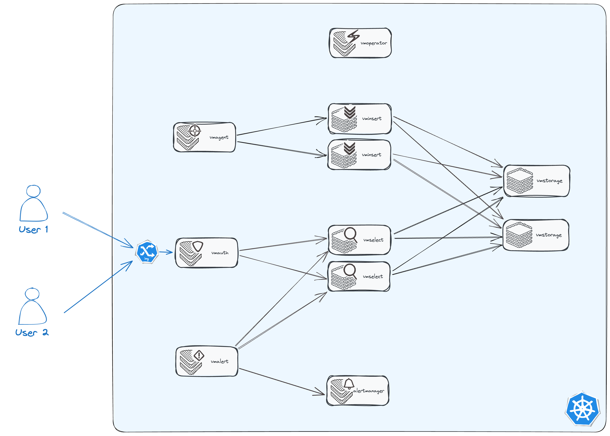

# VictoriaMetrics Operator QuickStart

VictoriaMetrics Operator serves to make running VictoriaMetrics applications on top of Kubernetes as easy as possible 
while preserving Kubernetes-native configuration options.

The shortest way to deploy full-stack monitoring cluster with VictoriaMetrics Operator is 
to use Helm-chart [victoria-metrics-k8s-stack](https://victoriametrics.github.io/helm-charts/charts/victoria-metrics-k8s-stack/).

You can follow the steps in documentation to use VictoriaMetrics Operator:

- [Setup](https://docs.victoriametrics.com/operator/setup.html)
- [Security](https://docs.victoriametrics.com/operator/security.html)
- [Configuration](https://docs.victoriametrics.com/operator/configuration.html)
- [Migration from Prometheus](https://docs.victoriametrics.com/operator/migration.html)
- [Monitoring](https://docs.victoriametrics.com/operator/monitoring.html)
- [Authorization and exposing components](https://docs.victoriametrics.com/operator/auth.html)
- [High Availability](https://docs.victoriametrics.com/operator/high-availability.html)
- [Enterprise](https://docs.victoriametrics.com/operator/enterprise.html)
- [Custom resources](https://docs.victoriametrics.com/operator/resources/)
- [Guides](https://docs.victoriametrics.com/operator/guides/)
- [FAQ (Frequency Asked Questions)](https://docs.victoriametrics.com/operator/faq.html)

But if you want to deploy VictoriaMetrics Operator quickly but from scratch (without using templating for custom resources), 
you can follow this guide.

## Setup operator

You can find out how to and instructions for installing the VictoriaMetrics operator into your kubernetes cluster
on the [Setup page](https://docs.victoriametrics.com/operator/setup.html).

Here we will elaborate on just one of the ways - for instance, we will install operator via Helm-chart
[victoria-metrics-operator](https://github.com/VictoriaMetrics/helm-charts/blob/master/charts/victoria-metrics-operator/README.md):

Add repo with helm-chart:

```shell
helm repo add vm https://victoriametrics.github.io/helm-charts/
helm repo update
```

Render `values.yaml` with default operator configuration:

```shell
helm show values vm/victoria-metrics-operator > values.yaml
```

Now you can configure operator - open rendered `values.yaml` file in your text editor. For example:

```shell
code values.yaml
```


Now you can change configuration in `values.yaml`. For more details about configuration options and methods,
see [configuration -> victoria-metrics-operator](https://docs.victoriametrics.com/operator/configuration.html#victoria-metrics-operator).

If you migrated from prometheus-operator, you can read about prometheus-operator objects conversion on 
the [migration from prometheus-operator](https://docs.victoriametrics.com/operator/migration.html).

Since we're looking at installing from scratch, let's disable prometheus-operator objects conversion,
and also let's set some resources for operator in `values.yaml`:

```yaml
# ...

operator:
  # -- By default, operator converts prometheus-operator objects.
  disable_prometheus_converter: true

# -- Resources for operator
resources:
  limits:
    cpu: 500m
    memory: 500Mi
  requests:
    cpu: 100m
    memory: 150Mi

# ...
```

You will need a kubernetes namespace to deploy the operator and VM components. Let's create it:

```shell
kubectl create namespace vm
```

After finishing with `values.yaml` and creating namespace, you can test the installation with command:

```shell
helm install vmoperator vm/victoria-metrics-operator -f values.yaml -n vm --debug --dry-run
```

Where `vm` is the namespace where you want to install operator. 

If everything is ok, you can install operator with command:

```shell
helm install vmoperator vm/victoria-metrics-operator -f values.yaml -n vm

# NAME: vmoperator
# LAST DEPLOYED: Thu Sep 14 15:13:04 2023
# NAMESPACE: vm
# STATUS: deployed
# REVISION: 1
# TEST SUITE: None
# NOTES:
# victoria-metrics-operator has been installed. Check its status by running:
#   kubectl --namespace vm get pods -l "app.kubernetes.io/instance=vmoperator"
#
# Get more information on https://github.com/VictoriaMetrics/helm-charts/tree/master/charts/victoria-metrics-operator.
# See "Getting started guide for VM Operator" on https://docs.victoriametrics.com/guides/getting-started-with-vm-operator.html .
```

And check that operator is running:

```shell
kubectl get pods -n vm -l "app.kubernetes.io/instance=vmoperator"

# NAME                                                    READY   STATUS    RESTARTS   AGE
# vmoperator-victoria-metrics-operator-7b88bd6df9-q9qwz   1/1     Running   0          98s
``` 

## Deploy components

Now you can create instances of VictoriaMetrics applications.
Let's create fullstack monitoring cluster with 
[`vmagent`](https://docs.victoriametrics.com/operator/resources/vmagent.html),
[`vmauth`](https://docs.victoriametrics.com/operator/resources/vmauth.html),
[`vmalert`](https://docs.victoriametrics.com/operator/resources/vmalert.html),
[`vmalertmanager`](https://docs.victoriametrics.com/operator/resources/vmalertmanager.html),  
[`vmcluster`](https://docs.victoriametrics.com/operator/resources/vmcluster.html)
(a component for deploying a cluster version of 
[VictoriaMetrics](https://docs.victoriametrics.com/Cluster-VictoriaMetrics.html#architecture-overview) 
consisting of `vmstorage`, `vmselect` and `vminsert`):



More details about resources of VictoriaMetrics operator you can find on the [resources page](https://docs.victoriametrics.com/operator/resources/). 

### VMCluster (vmselect, vminsert, vmstorage)

Let's start by deploying the [`vmcluster`](https://docs.victoriametrics.com/operator/resources/vmcluster.html) resource.

Create file `vmcluster.yaml` 

```shell
code vmcluster.yaml
```

with the following content:

```yaml
# vmcluster.yaml
apiVersion: operator.victoriametrics.com/v1beta1
kind: VMCluster
metadata:
  name: demo
spec:
  retentionPeriod: "1"
  replicationFactor: 2
  vmstorage:
    replicaCount: 2
    storageDataPath: "/vm-data"
    storage:
      volumeClaimTemplate:
        spec:
          resources:
            requests:
              storage: "10Gi"
    resources:
      limits:
        cpu: "1"
        memory: "1Gi"
  vmselect:
    replicaCount: 2
    cacheMountPath: "/select-cache"
    storage:
      volumeClaimTemplate:
        spec:
          resources:
            requests:
              storage: "1Gi"
    resources:
      limits:
        cpu: "1"
        memory: "1Gi"
      requests:
        cpu: "0.5"
        memory: "500Mi"
  vminsert:
    replicaCount: 2
    resources:
      limits:
        cpu: "1"
        memory: "1Gi"
      requests:
        cpu: "0.5"
        memory: "500Mi"
```

After that you can deploy `vmcluster` resource to the kubernetes cluster:

```shell
kubectl apply -f vmcluster.yaml -n vm

# vmcluster.operator.victoriametrics.com/demo created
```

Check that `vmcluster` is running:

```shell
kubectl get pods -n vm -l "app.kubernetes.io/instance=demo"

# NAME                             READY   STATUS    RESTARTS   AGE
# vminsert-demo-8688d88ff7-fnbnw   1/1     Running   0          3m39s
# vminsert-demo-8688d88ff7-5wbj7   1/1     Running   0          3m39s
# vmselect-demo-0                  1/1     Running   0          3m39s
# vmselect-demo-1                  1/1     Running   0          3m39s
# vmstorage-demo-1                 1/1     Running   0          22s
# vmstorage-demo-0                 1/1     Running   0          6s
```

Now you can see that 6 components of your demo vmcluster is running. 

In addition, you can see that the operator created services for each of the component type:

```shell
kubectl get svc -n vm -l "app.kubernetes.io/instance=demo"

# NAME             TYPE        CLUSTER-IP        EXTERNAL-IP   PORT(S)                      AGE
# vmstorage-demo   ClusterIP   None              <none>        8482/TCP,8400/TCP,8401/TCP   8m3s
# vmselect-demo    ClusterIP   None              <none>        8481/TCP                     8m3s
# vminsert-demo    ClusterIP   192.168.194.183   <none>        8480/TCP                     8m3s
```

We'll need them in the next steps.

More information about `vmcluster` resource you can find on 
the [vmcluster page](https://docs.victoriametrics.com/operator/resources/vmcluster.html).

### Scraping

#### VMAgent

Now let's deploy [`vmagent`](https://docs.victoriametrics.com/operator/resources/vmagent.html) resource.

Create file `vmagent.yaml` 

```shell
code vmagent.yaml
```

with the following content:

```yaml
apiVersion: operator.victoriametrics.com/v1beta1
kind: VMAgent
metadata:
  name: demo
spec:
  selectAllByDefault: true
  remoteWrite:
    - url: "http://vminsert-demo.vm.svc:8480/insert/0/prometheus/api/v1/write"
```

After that you can deploy `vmagent` resource to the kubernetes cluster:

```shell
kubectl apply -f vmagent.yaml -n vm

# vmagent.operator.victoriametrics.com/demo created
```

Check that `vmagent` is running:

```shell
kubectl get pods -n vm -l "app.kubernetes.io/instance=demo" -l "app.kubernetes.io/name=vmagent"

# NAME                            READY   STATUS    RESTARTS   AGE
# vmagent-demo-6785f7d7b9-zpbv6   2/2     Running   0          72s
```

More information about `vmagent` resource you can find on 
the [vmagent page](https://docs.victoriametrics.com/operator/resources/vmagent.html).

#### VMServiceScrape

Now we have the timeseries database (vmcluster) and the tool to collect metrics (vmagent) and send it to the database.

But we need to tell vmagent what metrics to collect. For this we will use [`vmservicescrape`](https://docs.victoriametrics.com/operator/resources/vmservicescrape.html) resource
or [other `*scrape` resources](https://docs.victoriametrics.com/operator/resources/).

By default, operator creates `vmservicescrape` resource for each component that it manages. More details about this you can find on
the [monitoring page](https://docs.victoriametrics.com/operator/configuration.html#monitoring-of-cluster-components).

For instance, we can create `vmservicescrape` for VictoriaMetrics operator manually. Let's create file `vmservicescrape.yaml`:

```shell
code vmservicescrape.yaml
```

with the following content:

```yaml
apiVersion: operator.victoriametrics.com/v1beta1
kind: VMServiceScrape
metadata:
  name: vmoperator-demo
spec:
  selector:
    matchLabels:
      app.kubernetes.io/instance: vmoperator
      app.kubernetes.io/name: victoria-metrics-operator
  namespaceSelector: 
    matchNames:
      - vm
```

After that you can deploy `vmservicescrape` resource to the kubernetes cluster:

```shell
kubectl apply -f vmservicescrape.yaml -n vm

# vmservicescrape.operator.victoriametrics.com/vmoperator-demo created
```

### Access

We need to look at the results of what we got. Up until now, we've just been looking only at the status of the pods. 

#### VMAuth

Let's expose our components with [`vmauth`](https://docs.victoriametrics.com/operator/resources/vmauth.html).

Create file `vmauth.yaml` 

```shell
code vmauth.yaml
```

with the following content:

```yaml
apiVersion: operator.victoriametrics.com/v1beta1
kind: VMAuth
metadata:
  name: demo
spec:
  userNamespaceSelector: {}
  userSelector: {}
  ingress:
    class_name: nginx # <-- change this to your ingress-controller
    host: vm-demo.k8s.orb.local # <-- change this to your domain
```

**Note** that content of `ingress` field depends on your ingress-controller and domain.
Your cluster will have them differently. 
Also, for simplicity, we don't use tls, but in real environments not having tls is unsafe.

#### VMUser

To get authorized access to our data it is necessary to create a user using 
the [vmuser](https://docs.victoriametrics.com/operator/resources/vmuser.html) resource.

Create file `vmuser.yaml` 

```shell
code vmuser.yaml
```

with the following content:

```yaml
apiVersion: operator.victoriametrics.com/v1beta1
kind: VMUser
metadata:
  name: demo
spec:
    name: demo
    username: demo
    generatePassword: true
    targetRefs:
      - crd:
          kind: VMCluster/vmselect
          name: demo
          namespace: vm
        target_path_suffix: "/select/0"
```

After that you can deploy `vmauth` and `vmuser` resources to the kubernetes cluster:

```shell
kubectl apply -f vmauth.yaml -n vm
kubectl apply -f vmuser.yaml -n vm

# vmauth.operator.victoriametrics.com/demo created
# vmuser.operator.victoriametrics.com/demo created
```

Operator automatically creates a secret with username/password token for `VMUser` resource with `generatePassword=true`:

```shell
kubectl get secret -n vm -l "app.kubernetes.io/instance=demo" -l "app.kubernetes.io/name=vmuser"

# NAME          TYPE     DATA   AGE
# vmuser-demo   Opaque   3      29m
```

You can get password for your user with command:

```shell
kubectl get secret -n vm vmuser-demo -o jsonpath="{.data.password}" | base64 --decode

# Yt3N2r3cPl
```

Now you can get access to your data with url `http://vm-demo.k8s.orb.local/vmui`, username `demo` 
and your given password (`Yt3N2r3cPl` in our case):


### Alerting

The remaining components will be needed for alerting. 

#### VMAlertmanager

Let's start with [`vmalertmanager`](https://docs.victoriametrics.com/operator/resources/vmalertmanager.html).

Create file `vmuser.yaml`

```shell
code vmuser.yaml
```

with the following content:

```yaml
apiVersion: operator.victoriametrics.com/v1beta1
kind: VMAlertmanager
metadata:
  name: demo
spec:
  configRawYaml: |
    global:
      resolve_timeout: 5m
    route:
      group_wait: 30s
      group_interval: 5m
      repeat_interval: 12h
      receiver: 'webhook'
    receivers:
    - name: 'webhook'
      webhook_configs:
      - url: 'http://your-webhook-url'
```

where webhook-url is the address of the webhook to receive notifications 
(configuration of AlertManager notifications will remain out of scope).
You can find more details about `alertmanager` configuration in 
the [Alertmanager documentation](https://prometheus.io/docs/alerting/latest/configuration/).

After that you can deploy `vmalertmanager` resource to the kubernetes cluster:

```shell
kubectl apply -f vmalertmanager.yaml -n vm

# vmalertmanager.operator.victoriametrics.com/demo created
```

Check that `vmalertmanager` is running:

```shell
kubectl get pods -n vm -l "app.kubernetes.io/instance=demo" -l "app.kubernetes.io/name=vmalertmanager"

# NAME                    READY   STATUS    RESTARTS   AGE
# vmalertmanager-demo-0   2/2     Running   0          107s
```

#### VMAlert

And now you can create [`vmalert`](https://docs.victoriametrics.com/operator/resources/vmalert.html) resource.

Create file `vmalert.yaml`

```shell
code vmalert.yaml
```

with the following content:

```yaml
apiVersion: operator.victoriametrics.com/v1beta1
kind: VMAlert
metadata:
  name: demo
spec:
  datasource:
    url: "http://vmselect-demo.vm.svc:8429"
  notifier:
    url: "http://vmalertmanager-demo.vm.svc:9093"
  evaluationInterval: "30s"
  selectAllByDefault: true
```

After that you can deploy `vmalert` resource to the kubernetes cluster:

```shell
kubectl apply -f vmalert.yaml -n vm

# vmalert.operator.victoriametrics.com/demo created
```

Check that `vmalert` is running:

```shell
kubectl get pods -n vm -l "app.kubernetes.io/instance=demo" -l "app.kubernetes.io/name=vmalert"

# NAME                           READY   STATUS    RESTARTS   AGE
# vmalert-demo-bf75c67cb-hh4qd   2/2     Running   0          5s
```

#### VMRule

Now you can create [`vmrule`](https://docs.victoriametrics.com/operator/resources/vmrule.html) resource 
for [vmalert](https://docs.victoriametrics.com/operator/resources/vmalert.html).

## Anything else

TODO (guides, FAQ, resources, issues.)
