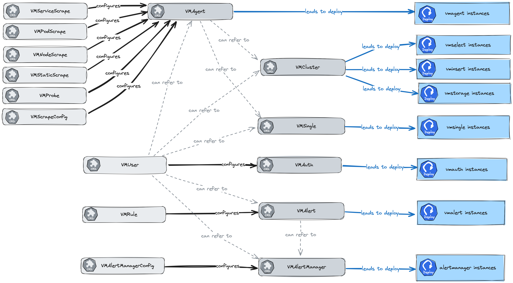

#  Custom resource kinds

This documentation section describes the design and interaction between the custom resource definitions (CRD) that the Victoria
Metrics Operator introduces.

[Operator]((https://docs.victoriametrics.com/operator/)) introduces the
following [custom resources](https://docs.victoriametrics.com/operator/#custom-resources):

- [VMAgent](https://docs.victoriametrics.com/operator/resources/vmagent.html)
- [VMAlert](https://docs.victoriametrics.com/operator/resources/vmalert.html)
- [VMAlertManager](https://docs.victoriametrics.com/operator/resources/vmalertmanager.html)
- [VMAlertManagerConfig](https://docs.victoriametrics.com/operator/resources/vmalertmanagerconfig.html)
- [VMAuth](https://docs.victoriametrics.com/operator/resources/vmauth.html)
- [VMCluster](https://docs.victoriametrics.com/operator/resources/vmcluster.html)
- [VMNodeScrape](https://docs.victoriametrics.com/operator/resources/vmnodescrape.html)
- [VMPodScrape](https://docs.victoriametrics.com/operator/resources/vmpodscrape.html)
- [VMProbe](https://docs.victoriametrics.com/operator/resources/vmprobe.html)
- [VMRule](https://docs.victoriametrics.com/operator/resources/vmrule.html)
- [VMServiceScrape](https://docs.victoriametrics.com/operator/resources/vmservicescrape.html)
- [VMStaticScrape](https://docs.victoriametrics.com/operator/resources/vmstaticscrape.html)
- [VMSingle](https://docs.victoriametrics.com/operator/resources/vmsingle.html)
- [VMUser](https://docs.victoriametrics.com/operator/resources/vmuser.html)

Here is the scheme of relations between the custom resources:

