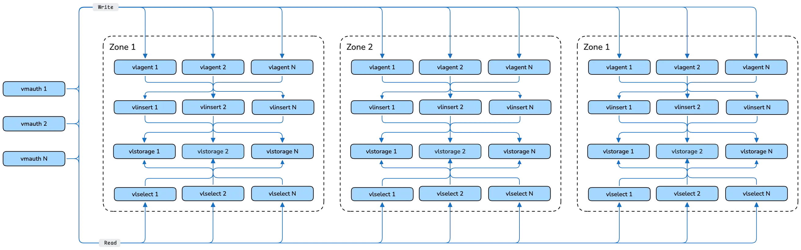

`VLDistributed` is the Custom Resource Definition for orchestrated updates of several VictoriaLogs clusters or single-node instances. It allows you to define and manage components of a distributed VictoriaLogs setup and apply changes to them sequentially, ensuring high availability and minimal disruption.

**Note:** `VLDistributed` is an experimental feature and may not be suitable for production environments. API is not yet stabilized and may change in future releases.



For a high-level overview of VictoriaLogs distributed architecture, refer to the official [VictoriaLogs cluster documentation](https://docs.victoriametrics.com/victorialogs/cluster/).

## Specification

The `VLDistributed` resource allows you to configure various aspects of your VictoriaLogs distributed setup. The specification includes:

*   `retain`: If set to `true`, the operator will keep managed components during VLDistributed CR removal.
*   `paused`: If set to `true`, the operator will not perform any actions on the underlying managed objects. Useful for temporarily halting reconciliation.
*   `backendType`: Specifies the backend type for **all** zones. Either `VLCluster` (default) or `VLSingle`. All zones must use the same backend type.
*   `vmauth`: Configuration for a `VMAuth` instance that acts as a proxy/load-balancer for read and write access to the managed VictoriaLogs backends.
*   `zoneCommon`: Defines `VLDistributedZoneCommon` common zone configuration, which is default for each zone resource.
*   `zones`: Defines the list of `VLDistributedZone` that form the distributed setup.
*   `license`: Configures the license key for enterprise features. If provided, it is automatically passed to managed `VLAgent` and `VLCluster` instances.

### `VLDistributedZoneCommon`

*   `vlcluster`: Common `VLDistributedZoneCluster` configuration. Only used when `spec.backendType: VLCluster`.
*   `vlsingle`: Common `VLDistributedZoneSingle` configuration. Only used when `spec.backendType: VLSingle`.
*   `vlagent`: Common `VLDistributedZoneAgent` configuration. It buffers and forwards write traffic to the zone backend.
*   `remoteWrite`: Common remote write settings for `VLAgent` in each zone. The operator controls the remote write URL.
*   `readyTimeout`: The readiness timeout for each zone update. Default is `5m`.
*   `updatePause`: Time the operator should wait between zone updates to ensure a smooth transition. Default is `1m`.

### `VLDistributedZone`

Each entry in the `zones` array includes:

*   `name` defines name of zone, which is used as default per-zone resource name or can be used in `zoneCommon` template using `%ZONE%` placeholder.
*   `trafficMode` defines allowed traffic mode for a zone: `read-write`, `read-only`, `write-only`, or `maintenance`.
*   `vlcluster` defines `VLDistributedZoneCluster`, that allows either reference an existing `VLCluster` resource or creates a new one. Only used when `spec.backendType: VLCluster`.
*   `vlsingle` defines `VLDistributedZoneSingle`, that allows either reference an existing `VLSingle` resource or creates a new one. Only used when `spec.backendType: VLSingle`.
*   `vlagent` defines `VLDistributedZoneAgent`, that allows either reference an existing `VLAgent` resource or creates one. It receives write traffic from `vmauth` and sends to `VLCluster` or `VLSingle` instances.
*   `remoteWrite` defines per-zone `VLAgent` remote write settings. The operator controls the remote write URL.

### `VLDistributedZoneCluster`

*   `name`: Optional name of an existing `VLCluster` or one to be created; when omitted it defaults to `zoneCommon.vlcluster.name` (where `%ZONE%` is used to template the zone name) or `${cr.Name}-${zone.name}` when unset.
*   `spec`: A `VLClusterSpec` object that defines the desired state of a new or referenced `VLCluster` managed by this resource.

### `VLDistributedZoneSingle`

*   `name`: Optional name of an existing `VLSingle` or one to be created; when omitted it defaults to `zoneCommon.vlsingle.name` (where `%ZONE%` is used to template the zone name) or `${cr.Name}-${zone.name}` when unset.
*   `spec`: A `VLSingleSpec` object that defines the desired state of a new or referenced `VLSingle` managed by this resource.

**Example: Defining a `VLDistributed` resource with `VLCluster` backend:**

```yaml
apiVersion: operator.victoriametrics.com/v1alpha1
kind: VLDistributed
metadata:
  name: my-distributed-logs
spec:
  vmauth:
    name: my-distributed-vmauth
    spec:
      replicaCount: 1
      unauthorizedUserAccessSpec:
        targetRefs:
          - name: read
          - name: write
  zoneCommon:
    vlagent:
      spec:
        replicaCount: 1
    vlcluster:
      spec:
        vlstorage:
          replicaCount: 1
        vlselect:
          replicaCount: 1
        vlinsert:
          replicaCount: 1
  zones:
    - name: zone-a
    - name: zone-b
      vlcluster:
        spec:
          vlselect:
            replicaCount: 2
```

**Example: Defining a `VLDistributed` resource with `VLSingle` backend:**

```yaml
apiVersion: operator.victoriametrics.com/v1alpha1
kind: VLDistributed
metadata:
  name: my-distributed-log-singles
spec:
  backendType: VLSingle
  vmauth:
    name: my-distributed-vmauth
    spec:
      replicaCount: 1
      unauthorizedUserAccessSpec:
        targetRefs:
          - name: read
          - name: write
  zoneCommon:
    vlagent:
      spec:
        replicaCount: 1
    vlsingle:
      spec:
        retentionPeriod: "30d"
  zones:
    - name: zone-a
    - name: zone-b
      vlsingle:
        spec:
          retentionPeriod: "14d"
```

### Ownership and references

`VLDistributed` creates or becomes an owner of existing `VMAuth`, `VLAgent`, `VLCluster`, and `VLSingle` resources and by default it removes all resources it owns on CR deletion. To remove `VLDistributed` but keep all owned resources set `spec.retain: true` before `VLDistributed` removal.

### Current shortcomings

- Only one `VMAuth` can be managed per `VLDistributed`.
- All objects must belong to the same namespace as the `VLDistributed`.
- Objects must be referred to by name; label selectors are not supported for `VMAuth`, `VLAgent`, `VLCluster` or `VLSingle` selection.
- `VLAgent`, `VLCluster` and `VLSingle` names must be unique across zones within one `VLDistributed` resource.
- All zones must use the same backend type (controlled by `spec.backendType`); mixing `VLCluster` and `VLSingle` zones in one `VLDistributed` is not supported.
- `VLCluster` read targets use `vlselect` API paths (`/select/...`); `VLSingle` read targets use single-node API paths (`/select/...`). Both are exposed as a `read` backend.

### Authorization

By default `VLDistributed` provides no access to read/write endpoints. Instead it provides preconfigured named backends `read` and `write`, which can be referenced in `spec.vmauth.spec.unauthorizedUserAccessSpec` section to provide unauthorized access or in `VMUser` spec for authorized access.

To provide unauthorized access to the distributed setup, add `spec.vmauth.spec.unauthorizedUserAccessSpec` section, where `read` and `write` backends should be referenced:

```yaml
spec:
  vmauth:
    spec:
      unauthorizedUserAccessSpec:
        targetRefs:
          - name: read
          - name: write
```

With configuration above both `read` and `write` endpoints become available for unauthorized access.

In order to configure authorization, `spec.vmauth.spec` should have [user selectors](https://docs.victoriametrics.com/operator/resources/vmauth/#users) properly configured and `VMUser` CRs should reference `read` and `write` backends in `targetRefs`:

```yaml
apiVersion: operator.victoriametrics.com/v1beta1
kind: VMUser
metadata:
  name: example
spec:
  username: simple-user
  password: simple-password
  targetRefs:
    - name: write
    - name: read
```
